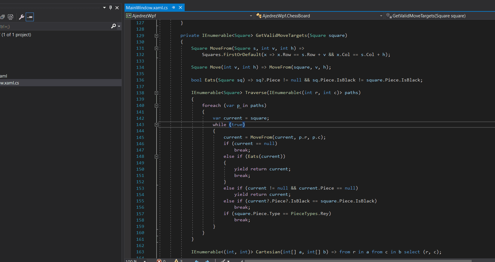

# Ajedrez en C# y WPF

## Juego completo de Ajedrez implementado en SOLO 277 líneas de código C# 8.0 y 94 líneas de XAML usando WPF corriendo sobre .NET Core 3.0

## Características:

  - Dos jugadores (Negras y Blancas)
  - Reglas básicas de movimientos de todas las piezas:
     - Peón
     - Alfil
     - Caballo
     - Torre
     - Reina
     - Rey
  - Marca en verde los casilleros válidos para mover
  - Historial de Movimientos (Panel Izquierdo)
  - Contador de piezas para cada jugador (Panel Derecho)
  - Se ajusta a la resolución de pantalla ("Responsive")
  - **SOLO 277 LINEAS DE C#**. 

## Faltantes:

  - lógica de jaque.
  - ciclo de juego (Nuevo juego, guardar, cargar, etc).
  - Notación Algebraica.
  
  