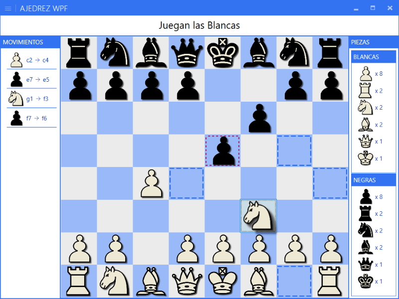
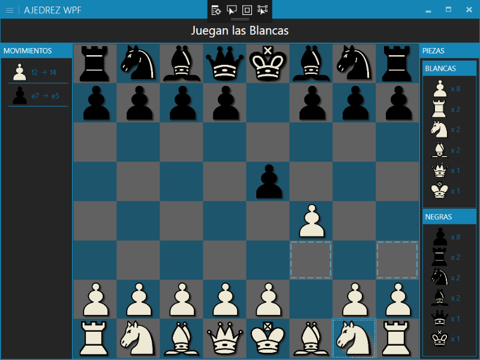

# Ajedrez en C#

## Juego completo de Ajedrez implementado en TAN SOLO **275** líneas de código C# y 178 líneas de XAML usando WPF corriendo sobre .NET 6.0

## Características:

  - Dos jugadores (Negras y Blancas)
  - Reglas básicas de movimientos de todas las piezas:
     - `Peón`
     - `Alfil`
     - `Caballo`
     - `Torre`
     - `Reina`
     - `Rey`
  - Marca en verde los casilleros válidos para mover
  - Historial de Movimientos (Panel Izquierdo)
  - Contador de piezas para cada jugador (Panel Derecho)
  - Se ajusta a la resolución de pantalla ("Responsive")
  - Menú principal con 4 botones.
    - `Nueva Partida`: inicia una nueva partida
    - `Cargar`: continuar una partida guardada
    - `Guardar`: guardar una partida para continuarla más tarde.
    - `Salir`: finaliza el juego.
  - [**SOLO 275 LINEAS DE C#**](https://github.com/agleiva/ajedrezwpf/blob/master/Src/MainWindow.xaml.cs). 
  
### Detalles Visuales / UX:
  
  - Al seleccionar una pieza para mover, se genera una sombra que da una apariencia de relieve.
  - Los casilleros válidos para mover se marcan con un marco verde ANIMADO. En caso de que haya una pieza del oponente para capturar, se marcan en rojo, con una animación diferente. Esto en el video de demo no se nota bien porque la app que usé para grabar la pantalla tiene menos framerate, pero la animación es super fluida en el juego.
  - El botón de la barra de título que desplega el menú principal lo hace de forma animada.
  - La construcción del tablero y el posicionamiento de las piezas al iniciar la partida se hace de forma "animada", agregando las piezas una a una de forma aleatoria y con un mini-delay de 50 milisegundos. Esto da una sensación de animación al tablero.
  - Estilos visuales con temas (MahApps.Metro). Cambiando una sola linea de XAML puedo darle diferentes estilos/temas por color:
  

## Faltantes:

  - lógica de jaque.
  - Notación Algebraica.